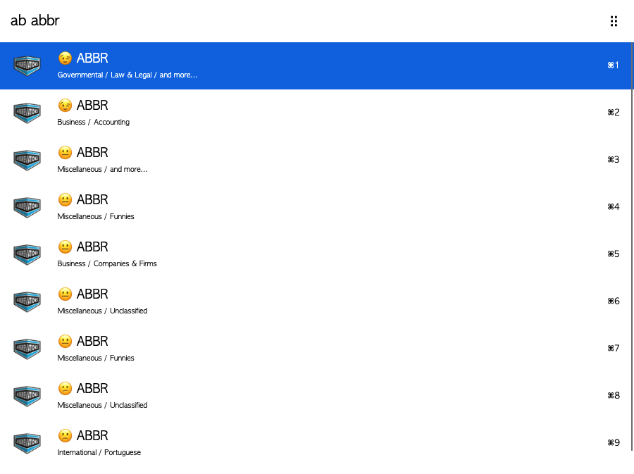

# arvis-abbreviation-workflow

> arvis workflow to query word abbreviation from abbreviations.com



## Install

```
$ npm install --global arvis-abbreviation-workflow
```


## Usage

In arvis, type `ab`, <kbd>Enter</kbd>, and the word, to find abbreviation.

Select an abbreviation and press <kbd>Enter</kbd> to copy it to the clipboard.

## License

MIT © [MinionsDave](https://github.com/MinionsDave)


## 🔗 This workflow is converted from [alfred-workflow](https://github.com/MinionsDave/alfred-abbreviation).

* Note that there might be some code change or different actions from the original workflow.

* Marked original workflow's creator to author.
